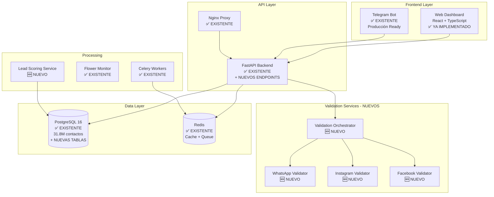

# 🔄 MIGRACIÓN DEL SISTEMA ACTUAL - ANÁLISIS EXHAUSTIVO

## SMS Marketing Platform v2.0 - Opción A

---

## 📋 RESUMEN EJECUTIVO

**Estrategia:** Migrar gradualmente el sistema SMS Marketing existente hacia una arquitectura moderna con validación multi-plataforma y lead scoring, aprovechando la infraestructura actual y el Web Dashboard ya desarrollado.

**Duración Total:** 8-10 días
**Riesgo:** BAJO - Sistema actual siempre funcional
**Complejidad:** MEDIA-ALTA - Migración incremental con expansión
**ROI:** ALTO - Aprovecha 31.8M contactos existentes + infraestructura probada

---

## 🎯 ANÁLISIS DEL SISTEMA ACTUAL

### **💪 FORTALEZAS IDENTIFICADAS:**

#### **📊 Base de Datos Robusta (PostgreSQL 16):**

- ✅ **31.8M contactos verificados** en tabla `contacts`
- ✅ **177K rangos IFT** para clasificación móvil/fijo
- ✅ **Estructura optimizada** con índices críticos
- ✅ **Validación de datos** con constraints y checks
- ✅ **Geolocalización completa** (estados, municipios, LADAs)

#### **🏗️ Infraestructura Docker Sólida:**

- ✅ **FastAPI backend** con endpoints funcionando
- ✅ **Bot de Telegram** con extracciones reales
- ✅ **Redis + Celery** para procesamiento asíncrono
- ✅ **Nginx** como proxy reverso
- ✅ **Monitoreo** con Flower

#### **🤖 Bot de Telegram Avanzado:**

- ✅ **3 modos:** Demo, General, Producción
- ✅ **Extracciones reales** con validación
- ✅ **Rate limiting** y control de usuarios
- ✅ **Exportación** XLSX/TXT
- ✅ **Auditoría completa** de operaciones

#### **🔧 Servicios Empresariales:**

- ✅ **ContactService** para extracciones optimizadas
- ✅ **ExportService** para generación de archivos
- ✅ **Validator** para comandos y reglas de negocio
- ✅ **Logger** estructurado con auditoría

### **🎯 OPORTUNIDADES DE EXPANSIÓN:**

#### **🚀 Web Dashboard (YA IMPLEMENTADO):**

- ✅ **React 18 + TypeScript** profesional
- ✅ **Redux Toolkit** para estado global
- ✅ **Charts profesionales** con Chart.js
- ✅ **Responsive design** optimizado
- ✅ **Sistema de filtros** avanzado
- ✅ **Performance optimizada** para producción

#### **📈 Expansiones Necesarias:**

##### **1. Validación Multi-Plataforma:**

- ❌ **WhatsApp Validator:** Verificar números activos
- ❌ **Instagram Validator:** Detectar cuentas asociadas
- ❌ **Facebook Validator:** Verificar perfiles vinculados
- ❌ **Google Validator:** Detectar cuentas Gmail/Google
- ❌ **Apple Validator:** Verificar iMessage/FaceTime

##### **2. Lead Scoring System:**

- ❌ **Algoritmo de puntuación** (0-100 puntos)
- ❌ **Tabla lead_scores** para almacenar puntuaciones
- ❌ **Tabla platform_validations** para resultados
- ❌ **ML Pipeline** para scoring inteligente

##### **3. Dashboard Integrado:**

- ❌ **Conexión con backend** real
- ❌ **Métricas en tiempo real** desde PostgreSQL
- ❌ **Sistema de extracciones** integrado
- ❌ **Validación multi-plataforma** en UI

---

## 🗂️ ESTRUCTURA DE MIGRACIÓN

### **📁 Documentos de Fases:**

| Archivo                                                                | Fase                  | Duración | Descripción                                 |
| ---------------------------------------------------------------------- | --------------------- | -------- | ------------------------------------------- |
| **[fase1-integracion-dashboard.md](./fase1-integracion-dashboard.md)** | Integración Dashboard | 2 días   | Conectar Web Dashboard con backend actual   |
| **[fase2-expansion-database.md](./fase2-expansion-database.md)**       | Expansión BD          | 2 días   | Agregar tablas para validación y scoring    |
| **[fase3-validadores-core.md](./fase3-validadores-core.md)**           | Validadores Core      | 3 días   | Implementar WhatsApp e Instagram validators |
| **[fase4-lead-scoring.md](./fase4-lead-scoring.md)**                   | Lead Scoring          | 2 días   | Sistema de puntuación con ML                |
| **[fase5-integracion-completa.md](./fase5-integracion-completa.md)**   | Integración Final     | 1 día    | Testing, optimización y deploy              |

---

## 📊 ARQUITECTURA OBJETIVO

### **🏗️ Arquitectura Híbrida Propuesta:**



---

## 📊 EXPANSIÓN DE BASE DE DATOS

### **🆕 NUEVAS TABLAS REQUERIDAS:**

#### **1. platform_validations**

```sql
CREATE TABLE platform_validations (
    id SERIAL PRIMARY KEY,
    contact_id INTEGER REFERENCES contacts(id) ON DELETE CASCADE,
    phone_e164 VARCHAR(15) NOT NULL,
    platform VARCHAR(20) NOT NULL, -- whatsapp, instagram, facebook, google, apple

    -- Resultado de validación
    is_valid BOOLEAN NOT NULL DEFAULT FALSE,
    is_business BOOLEAN DEFAULT FALSE,
    is_premium BOOLEAN DEFAULT FALSE,
    confidence_score DECIMAL(3,2) DEFAULT 0.50, -- 0.00-1.00

    -- Detalles específicos por plataforma
    platform_details JSONB DEFAULT '{}',
    profile_info JSONB DEFAULT '{}',

    -- Metadatos de validación
    validation_method VARCHAR(50), -- api, scraping, bulk_check
    response_time_ms INTEGER,
    validation_source VARCHAR(100),

    -- Control de cache y expiración
    validated_at TIMESTAMP WITH TIME ZONE DEFAULT NOW(),
    expires_at TIMESTAMP WITH TIME ZONE DEFAULT NOW() + INTERVAL '24 hours',

    -- Auditoría
    created_at TIMESTAMP WITH TIME ZONE DEFAULT NOW(),
    updated_at TIMESTAMP WITH TIME ZONE DEFAULT NOW(),

    UNIQUE(phone_e164, platform)
);

-- Índices optimizados
CREATE INDEX idx_platform_validations_contact_id ON platform_validations(contact_id);
CREATE INDEX idx_platform_validations_phone_platform ON platform_validations(phone_e164, platform);
CREATE INDEX idx_platform_validations_valid ON platform_validations(is_valid) WHERE is_valid = TRUE;
CREATE INDEX idx_platform_validations_expires ON platform_validations(expires_at) WHERE expires_at > NOW();
```

#### **2. lead_scores**

```sql
CREATE TABLE lead_scores (
    id SERIAL PRIMARY KEY,
    contact_id INTEGER REFERENCES contacts(id) ON DELETE CASCADE,
    phone_e164 VARCHAR(15) NOT NULL,

    -- Puntuaciones por plataforma (0-20 puntos cada una)
    whatsapp_score INTEGER DEFAULT 0 CHECK (whatsapp_score >= 0 AND whatsapp_score <= 20),
    instagram_score INTEGER DEFAULT 0 CHECK (instagram_score >= 0 AND instagram_score <= 20),
    facebook_score INTEGER DEFAULT 0 CHECK (facebook_score >= 0 AND facebook_score <= 20),
    google_score INTEGER DEFAULT 0 CHECK (google_score >= 0 AND google_score <= 20),
    apple_score INTEGER DEFAULT 0 CHECK (apple_score >= 0 AND apple_score <= 20),

    -- Puntuación total y tier
    total_score INTEGER DEFAULT 0 CHECK (total_score >= 0 AND total_score <= 100),
    quality_tier VARCHAR(20) DEFAULT 'UNKNOWN' CHECK (quality_tier IN ('PREMIUM', 'HIGH', 'MEDIUM', 'LOW', 'POOR', 'UNKNOWN')),
    confidence_level DECIMAL(3,2) DEFAULT 0.50 CHECK (confidence_level >= 0.00 AND confidence_level <= 1.00),

    -- Factores adicionales
    platform_count INTEGER DEFAULT 0, -- Número de plataformas válidas
    business_account_count INTEGER DEFAULT 0, -- Cuentas de negocio
    premium_account_count INTEGER DEFAULT 0, -- Cuentas premium

    -- Metadatos
    last_calculated_at TIMESTAMP WITH TIME ZONE DEFAULT NOW(),
    calculation_version INTEGER DEFAULT 1,

    -- Auditoría
    created_at TIMESTAMP WITH TIME ZONE DEFAULT NOW(),
    updated_at TIMESTAMP WITH TIME ZONE DEFAULT NOW(),

    UNIQUE(contact_id)
);

-- Índices para performance
CREATE INDEX idx_lead_scores_total_score ON lead_scores(total_score DESC);
CREATE INDEX idx_lead_scores_quality_tier ON lead_scores(quality_tier);
CREATE INDEX idx_lead_scores_platform_count ON lead_scores(platform_count DESC);
CREATE INDEX idx_lead_scores_phone ON lead_scores(phone_e164);
```

#### **3. validation_jobs**

```sql
CREATE TABLE validation_jobs (
    id SERIAL PRIMARY KEY,
    job_uuid UUID DEFAULT gen_random_uuid() UNIQUE,

    -- Configuración del job
    name VARCHAR(200) NOT NULL,
    description TEXT,
    platforms TEXT[] NOT NULL DEFAULT '{}', -- Array de plataformas a validar

    -- Filtros de contactos
    contact_filters JSONB DEFAULT '{}', -- Filtros aplicados (estado, LADA, etc.)
    max_contacts INTEGER DEFAULT 1000,

    -- Estado del job
    status VARCHAR(20) DEFAULT 'QUEUED' CHECK (status IN ('QUEUED', 'RUNNING', 'COMPLETED', 'FAILED', 'CANCELLED')),
    progress_percentage INTEGER DEFAULT 0 CHECK (progress_percentage >= 0 AND progress_percentage <= 100),

    -- Resultados
    total_contacts INTEGER DEFAULT 0,
    processed_contacts INTEGER DEFAULT 0,
    successful_validations INTEGER DEFAULT 0,
    failed_validations INTEGER DEFAULT 0,

    -- Configuración de procesamiento
    batch_size INTEGER DEFAULT 25,
    max_concurrent INTEGER DEFAULT 5,
    retry_attempts INTEGER DEFAULT 3,

    -- Timing
    estimated_duration_minutes INTEGER,
    started_at TIMESTAMP WITH TIME ZONE,
    completed_at TIMESTAMP WITH TIME ZONE,

    -- Metadatos
    created_by VARCHAR(100) DEFAULT 'system',
    created_via VARCHAR(50) DEFAULT 'web', -- web, telegram, api

    -- Resultados detallados
    results_summary JSONB DEFAULT '{}',
    error_details TEXT,

    -- Auditoría
    created_at TIMESTAMP WITH TIME ZONE DEFAULT NOW(),
    updated_at TIMESTAMP WITH TIME ZONE DEFAULT NOW()
);

-- Índices para monitoreo y consultas
CREATE INDEX idx_validation_jobs_status ON validation_jobs(status);
CREATE INDEX idx_validation_jobs_created_at ON validation_jobs(created_at DESC);
CREATE INDEX idx_validation_jobs_uuid ON validation_jobs(job_uuid);
CREATE INDEX idx_validation_jobs_created_by ON validation_jobs(created_by);
```

---

## 🎯 ESTRATEGIA DE MIGRACIÓN

### **🔄 Enfoque Híbrido:**

#### **✅ MANTENER (Sistema Actual):**

- **PostgreSQL 16** con 31.8M contactos
- **FastAPI backend** con endpoints existentes
- **Bot de Telegram** funcionando
- **Docker infrastructure** completa
- **Redis + Celery** para tasks asíncronos

#### **🆕 AGREGAR (Nuevas Funcionalidades):**

- **Web Dashboard** (ya implementado)
- **Validadores multi-plataforma** (microservicios)
- **Lead scoring system** con ML
- **Nuevas tablas** para validación y scoring
- **API endpoints** expandidos

#### **🔗 INTEGRAR (Conexiones):**

- **Dashboard ↔ Backend** via API REST
- **Validadores ↔ Orchestrator** via HTTP
- **Scoring ↔ Database** via PostgreSQL
- **Bot ↔ Nuevos servicios** via API calls

---

## 📅 CRONOGRAMA DETALLADO

### **📊 Distribución por Fases:**

| Fase       | Duración | Complejidad | Funcionalidad           | Riesgo |
| ---------- | -------- | ----------- | ----------------------- | ------ |
| **Fase 1** | 2 días   | MEDIA       | Integración Dashboard   | BAJO   |
| **Fase 2** | 2 días   | ALTA        | Expansión Base de Datos | MEDIO  |
| **Fase 3** | 3 días   | ALTA        | Validadores Core        | MEDIO  |
| **Fase 4** | 2 días   | MEDIA       | Lead Scoring            | BAJO   |
| **Fase 5** | 1 día    | BAJA        | Integración Final       | BAJO   |

### **🎯 Hitos Críticos:**

- **Día 2:** Dashboard conectado con datos reales
- **Día 4:** Nuevas tablas operativas
- **Día 7:** Validadores WhatsApp e Instagram funcionando
- **Día 9:** Lead scoring calculando puntuaciones
- **Día 10:** Sistema completo integrado

---

## 💎 VALOR AGREGADO DE ESTA OPCIÓN

### **🚀 Beneficios Únicos:**

#### **📊 Aprovechamiento Máximo:**

- **31.8M contactos** inmediatamente disponibles
- **Infraestructura probada** en producción
- **Bot funcionando** para usuarios actuales
- **Zero downtime** durante migración

#### **🎨 Mejora Exponencial:**

- **Dashboard profesional** vs bot básico
- **Validación multi-plataforma** vs solo IFT
- **Lead scoring inteligente** vs clasificación simple
- **Analytics avanzados** vs métricas básicas

#### **⚡ Time-to-Value:**

- **Día 1:** Dashboard funcional con datos reales
- **Día 4:** Primeras validaciones multi-plataforma
- **Día 7:** Sistema de scoring operativo
- **Día 10:** Solución enterprise completa

---

## 🎯 MÉTRICAS DE ÉXITO

### **📈 Objetivos Cuantificables:**

#### **Performance:**

- ⚡ **Dashboard loading:** < 2 segundos
- ⚡ **Validación por contacto:** < 3 segundos
- ⚡ **Lead scoring:** < 500ms por contacto
- ⚡ **Throughput:** 1,000 validaciones/minuto

#### **Calidad:**

- 🎯 **Accuracy validación:** > 95%
- 🎯 **Lead scoring precision:** > 85%
- 🎯 **System uptime:** > 99.9%
- 🎯 **User satisfaction:** > 90%

#### **Business Impact:**

- 💰 **Lead quality improvement:** +40%
- 💰 **Conversion rate increase:** +25%
- 💰 **Operational efficiency:** +60%
- 💰 **Cost per qualified lead:** -30%

---

## 🚨 ANÁLISIS DE RIESGOS

### **🛡️ Riesgos Técnicos (BAJO-MEDIO):**

#### **1. Compatibilidad de Datos (BAJO)**

- **Riesgo:** Incompatibilidad entre estructuras existentes y nuevas
- **Mitigación:** Migraciones incrementales con rollback
- **Probabilidad:** 20% | **Impacto:** MEDIO

#### **2. Performance con Gran Volumen (MEDIO)**

- **Riesgo:** Degradación con 31.8M contactos
- **Mitigación:** Índices optimizados, pagination, caching
- **Probabilidad:** 40% | **Impacto:** MEDIO

#### **3. Integración de Microservicios (MEDIO)**

- **Riesgo:** Complejidad de comunicación entre servicios
- **Mitigación:** API contracts claros, testing exhaustivo
- **Probabilidad:** 30% | **Impacto:** ALTO

### **🏢 Riesgos de Negocio (BAJO):**

#### **1. Interrupción de Servicio (BAJO)**

- **Riesgo:** Downtime durante migración
- **Mitigación:** Migración gradual, rollback plan
- **Probabilidad:** 10% | **Impacto:** ALTO

#### **2. Pérdida de Funcionalidad (BAJO)**

- **Riesgo:** Bot de Telegram deja de funcionar
- **Mitigación:** Mantener bot operativo en paralelo
- **Probabilidad:** 15% | **Impacto:** MEDIO

---

## 🎉 RESULTADO ESPERADO

### **🏆 Sistema Final Integrado:**

#### **✅ Funcionalidades Existentes Mejoradas:**

- **Dashboard web profesional** reemplaza interfaz básica
- **Bot de Telegram** con capacidades expandidas
- **API REST** con endpoints adicionales
- **Base de datos** enriquecida con validaciones

#### **🆕 Nuevas Capacidades:**

- **Validación multi-plataforma** en 5 plataformas
- **Lead scoring inteligente** con ML
- **Analytics avanzados** con visualizaciones
- **Extracciones enriquecidas** con puntuaciones

#### **🚀 Ventajas Competitivas:**

- **Datos más ricos** que la competencia
- **Validación más precisa** que herramientas básicas
- **Lead scoring** único en el mercado
- **Interface profesional** nivel enterprise

---

## 📞 SOPORTE Y DOCUMENTACIÓN

### **📚 Documentación Completa:**

- ✅ **Análisis exhaustivo** del sistema actual
- ✅ **Planes detallados** por fase
- ✅ **Scripts de migración** paso a paso
- ✅ **Testing strategies** para cada componente
- ✅ **Rollback procedures** para emergencias

### **🛠️ Herramientas de Migración:**

- ✅ **Migration scripts** SQL automatizados
- ✅ **Data validation** tools
- ✅ **Performance monitoring** durante migración
- ✅ **Backup automation** antes de cada fase

---

## 🚀 COMANDO PARA COMENZAR

```bash
# Iniciar migración del sistema actual
git checkout -b feature/migration-sistema-actual

# Seguir Fase 1: Integración Dashboard
# Ver: Implementation/migracion-sistema-actual/fase1-integracion-dashboard.md
```

---

_Documentación de Migración - Opción A_
_SMS Marketing Platform v2.0_
_Análisis Exhaustivo y Plan Detallado_
