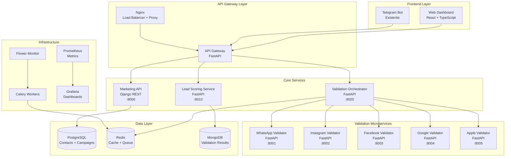

# 🚀 FASE 1: Fundación y Arquitectura del Sistema de Validación Multi-Plataforma

## 📋 Resumen Ejecutivo

**Objetivo:** Establecer la arquitectura base para el sistema de validación multi-plataforma, integrando el sistema SMS Marketing existente con microservicios de validación para WhatsApp, Instagram, Facebook, Google y Apple.

**Duración Estimada:** 4-6 semanas  
**Complejidad:** Alta  
**Dependencias:** Sistema SMS Marketing actual (31.8M contactos)

---

## 🏗️ Análisis del Sistema Actual

### **Fortalezas Identificadas:**
- ✅ **Base de datos robusta:** PostgreSQL 16 con 31.8M contactos verificados
- ✅ **Infraestructura Docker:** Servicios containerizados (API, Worker, Bot, Redis, Nginx)
- ✅ **Sistema de colas:** Celery + Redis para procesamiento asíncrono
- ✅ **API REST:** FastAPI con autenticación y documentación automática
- ✅ **Bot Telegram:** Sistema de extracción funcional con validación
- ✅ **Monitoreo:** Flower para Celery, logging estructurado
- ✅ **Clasificación IFT:** Sistema de validación móvil/fijo implementado

### **Gaps Identificados:**
- ❌ **No hay GUI web:** Solo bot Telegram y API
- ❌ **Validación limitada:** Solo IFT, no plataformas sociales
- ❌ **Sistema de scoring:** No existe puntuación de calidad de leads
- ❌ **Microservicios:** Arquitectura monolítica actual
- ❌ **Load balancing:** Nginx configurado pero no optimizado para microservicios

---

## 🎯 Objetivos de la Fase 1

### **1. Arquitectura de Microservicios**
- Diseñar arquitectura distribuida para validadores
- Establecer comunicación entre servicios
- Implementar service discovery y load balancing

### **2. Sistema de Scoring de Leads**
- Diseñar algoritmo de puntuación (0-100 puntos)
- Crear base de datos para tracking de validaciones
- Implementar sistema de pesos por plataforma

### **3. Dashboard Web (GUI)**
- Desarrollar interfaz web moderna
- Integrar con sistema existente
- Panel de control para campañas y validaciones

### **4. Infraestructura Base**
- Configurar red de microservicios
- Implementar service mesh básico
- Establecer monitoreo distribuido

---

## 🏛️ Arquitectura Propuesta

### **Componentes Principales:**



---

## 📊 Modelo de Datos Extendido

### **Nuevas Tablas Requeridas:**

#### **1. lead_scores**
```sql
CREATE TABLE lead_scores (
    id SERIAL PRIMARY KEY,
    contact_id INTEGER REFERENCES contacts(id),
    phone_e164 VARCHAR(15) NOT NULL,
    
    -- Puntuaciones por plataforma (0-20 puntos cada una)
    whatsapp_score INTEGER DEFAULT 0,
    instagram_score INTEGER DEFAULT 0,
    facebook_score INTEGER DEFAULT 0,
    google_score INTEGER DEFAULT 0,
    apple_score INTEGER DEFAULT 0,
    
    -- Puntuación total (0-100)
    total_score INTEGER DEFAULT 0,
    quality_tier VARCHAR(20) DEFAULT 'UNKNOWN', -- PREMIUM, HIGH, MEDIUM, LOW, POOR
    
    -- Metadatos
    last_validated_at TIMESTAMP WITH TIME ZONE,
    validation_count INTEGER DEFAULT 0,
    created_at TIMESTAMP WITH TIME ZONE DEFAULT NOW(),
    updated_at TIMESTAMP WITH TIME ZONE DEFAULT NOW()
);

CREATE INDEX idx_lead_scores_contact_id ON lead_scores(contact_id);
CREATE INDEX idx_lead_scores_total_score ON lead_scores(total_score DESC);
CREATE INDEX idx_lead_scores_quality_tier ON lead_scores(quality_tier);
```

#### **2. platform_validations**
```sql
CREATE TABLE platform_validations (
    id SERIAL PRIMARY KEY,
    contact_id INTEGER REFERENCES contacts(id),
    phone_e164 VARCHAR(15) NOT NULL,
    platform VARCHAR(20) NOT NULL, -- whatsapp, instagram, facebook, google, apple
    
    -- Resultado de validación
    status VARCHAR(20) NOT NULL, -- ACTIVE, INACTIVE, ERROR, RATE_LIMITED, NOT_FOUND
    is_active BOOLEAN,
    platform_details JSONB, -- Detalles específicos de cada plataforma
    
    -- Metadatos de validación
    validation_method VARCHAR(50), -- api, scraping, bulk_check
    proxy_used VARCHAR(100),
    response_time_ms INTEGER,
    attempts INTEGER DEFAULT 1,
    
    -- Timestamps
    validated_at TIMESTAMP WITH TIME ZONE DEFAULT NOW(),
    expires_at TIMESTAMP WITH TIME ZONE, -- Cache expiration
    
    UNIQUE(phone_e164, platform)
);

CREATE INDEX idx_platform_validations_phone_platform ON platform_validations(phone_e164, platform);
CREATE INDEX idx_platform_validations_status ON platform_validations(status);
CREATE INDEX idx_platform_validations_expires_at ON platform_validations(expires_at);
```

#### **3. validation_jobs**
```sql
CREATE TABLE validation_jobs (
    id SERIAL PRIMARY KEY,
    job_uuid UUID DEFAULT gen_random_uuid(),
    
    -- Configuración del job
    name VARCHAR(200) NOT NULL,
    platforms VARCHAR(20)[] NOT NULL, -- Array de plataformas
    phone_numbers TEXT[] NOT NULL, -- Array de números
    
    -- Estado del job
    status VARCHAR(20) DEFAULT 'QUEUED', -- QUEUED, RUNNING, COMPLETED, FAILED, CANCELLED
    progress INTEGER DEFAULT 0, -- Porcentaje 0-100
    
    -- Resultados
    total_numbers INTEGER NOT NULL,
    processed_numbers INTEGER DEFAULT 0,
    successful_validations INTEGER DEFAULT 0,
    failed_validations INTEGER DEFAULT 0,
    
    -- Configuración
    batch_size INTEGER DEFAULT 25,
    max_concurrent INTEGER DEFAULT 20,
    retry_attempts INTEGER DEFAULT 3,
    
    -- Metadatos
    created_by VARCHAR(100),
    created_at TIMESTAMP WITH TIME ZONE DEFAULT NOW(),
    started_at TIMESTAMP WITH TIME ZONE,
    completed_at TIMESTAMP WITH TIME ZONE,
    
    -- Resultados detallados
    results JSONB,
    error_message TEXT
);

CREATE INDEX idx_validation_jobs_status ON validation_jobs(status);
CREATE INDEX idx_validation_jobs_created_at ON validation_jobs(created_at DESC);
CREATE INDEX idx_validation_jobs_uuid ON validation_jobs(job_uuid);
```

---

## 🛠️ Stack Tecnológico Definido

### **Frontend (Web Dashboard):**
```json
{
  "framework": "React 18 + TypeScript",
  "ui_library": "Material-UI v5 / Ant Design",
  "state_management": "Redux Toolkit + RTK Query",
  "routing": "React Router v6",
  "charts": "Chart.js / Recharts",
  "build_tool": "Vite",
  "testing": "Jest + React Testing Library"
}
```

### **Backend Services:**
```json
{
  "api_gateway": "FastAPI + Uvicorn",
  "marketing_api": "Django 4.2 + DRF",
  "microservices": "FastAPI + Uvicorn",
  "task_queue": "Celery + Redis",
  "caching": "Redis 7",
  "service_mesh": "Traefik / Nginx",
  "monitoring": "Prometheus + Grafana"
}
```

### **Bases de Datos:**
```json
{
  "primary": "PostgreSQL 16 (Contacts, Campaigns, Users)",
  "validation_cache": "MongoDB 7 (Validation Results)",
  "session_cache": "Redis 7 (Sessions, Jobs, Cache)",
  "time_series": "InfluxDB (Metrics, opcional)"
}
```

### **Infraestructura:**
```json
{
  "containerization": "Docker + Docker Compose",
  "orchestration": "Docker Swarm / Kubernetes (futuro)",
  "reverse_proxy": "Nginx + Traefik",
  "monitoring": "Prometheus + Grafana + AlertManager",
  "logging": "ELK Stack (Elasticsearch + Logstash + Kibana)"
}
```

---

## 📋 Tareas Detalladas de la Fase 1

### **Sprint 1: Arquitectura y Diseño (Semana 1-2)**

#### **1.1 Diseño de Arquitectura**
- [ ] **Documentar arquitectura de microservicios**
  - Crear diagramas de componentes
  - Definir interfaces entre servicios
  - Establecer patrones de comunicación
- [ ] **Definir API contracts**
  - OpenAPI specs para cada microservicio
  - Esquemas de request/response estandarizados
  - Códigos de error unificados
- [ ] **Diseñar sistema de scoring**
  - Algoritmo de puntuación por plataforma
  - Pesos y factores de calidad
  - Tiers de clasificación (Premium, High, Medium, Low, Poor)

#### **1.2 Extensión de Base de Datos**
- [ ] **Crear migraciones para nuevas tablas**
  - `lead_scores`, `platform_validations`, `validation_jobs`
  - Índices optimizados para consultas frecuentes
  - Constraints y validaciones
- [ ] **Configurar MongoDB para validaciones**
  - Colecciones para resultados de validación
  - Índices TTL para expiración automática
  - Esquemas de documentos
- [ ] **Actualizar modelos existentes**
  - Extender modelo `Contact` con scoring
  - Nuevos endpoints en API existente

#### **1.3 Configuración de Infraestructura**
- [ ] **Extender docker-compose.yml**
  - Servicios para nuevos microservicios
  - Red interna para comunicación
  - Variables de entorno centralizadas
- [ ] **Configurar service discovery**
  - Registro de servicios en Redis/Consul
  - Health checks para todos los servicios
  - Load balancing básico

### **Sprint 2: Servicios Core (Semana 3-4)**

#### **2.1 API Gateway**
- [ ] **Implementar API Gateway con FastAPI**
  - Routing a microservicios
  - Autenticación centralizada
  - Rate limiting global
  - Logging de requests
- [ ] **Configurar Nginx como Load Balancer**
  - Upstream pools para microservicios
  - Health checks
  - SSL termination
  - Caching de respuestas

#### **2.2 Lead Scoring Service**
- [ ] **Desarrollar servicio de scoring**
  - Algoritmo de cálculo de puntuación
  - API para actualizar scores
  - Cache de resultados en Redis
  - Webhooks para notificaciones
- [ ] **Implementar lógica de negocio**
  - Pesos por plataforma configurables
  - Reglas de negocio para tiers
  - Histórico de cambios de score

#### **2.3 Validation Orchestrator**
- [ ] **Crear orquestador de validaciones**
  - Distribución de trabajo a microservicios
  - Manejo de jobs asíncronos
  - Agregación de resultados
  - Retry logic y error handling

### **Sprint 3: Microservicios Base (Semana 5-6)**

#### **3.1 Estructura Base de Microservicios**
- [ ] **Template base para validadores**
  - Estructura común FastAPI
  - Logging estandarizado
  - Health checks
  - Métricas Prometheus
- [ ] **Implementar validador mock**
  - Servicio de prueba con respuestas simuladas
  - Testing de integración
  - Validación de contratos API

#### **3.2 Monitoreo y Observabilidad**
- [ ] **Configurar Prometheus + Grafana**
  - Métricas de aplicación
  - Dashboards para microservicios
  - Alertas básicas
- [ ] **Implementar logging centralizado**
  - Structured logging con JSON
  - Correlación de requests
  - Log aggregation

#### **3.3 Dashboard Web Básico**
- [ ] **Crear aplicación React**
  - Setup con Vite + TypeScript
  - Configuración de routing
  - Integración con API Gateway
- [ ] **Implementar vistas básicas**
  - Dashboard principal
  - Lista de contactos con scores
  - Vista de jobs de validación

---

## 🔧 Configuración Técnica

### **Docker Compose Extendido:**
```yaml
# Nuevos servicios a agregar
services:
  # API Gateway
  gateway:
    build: ./services/gateway
    ports:
      - "8080:8080"
    environment:
      - MICROSERVICES_REGISTRY=redis://redis:6379/1
    depends_on:
      - redis

  # Lead Scoring Service
  scoring:
    build: ./services/scoring
    ports:
      - "8010:8010"
    environment:
      - DATABASE_URL=postgresql://...
      - MONGODB_URL=mongodb://mongo:27017/validations
    depends_on:
      - postgres
      - mongo

  # Validation Orchestrator
  orchestrator:
    build: ./services/orchestrator
    ports:
      - "8020:8020"
    environment:
      - CELERY_BROKER_URL=redis://redis:6379/0
      - MICROSERVICES_REGISTRY=redis://redis:6379/1

  # MongoDB for validation results
  mongo:
    image: mongo:7
    ports:
      - "27017:27017"
    volumes:
      - mongo_data:/data/db

  # Web Dashboard
  dashboard:
    build: ./frontend
    ports:
      - "3000:3000"
    environment:
      - REACT_APP_API_URL=http://gateway:8080

volumes:
  mongo_data:
```

### **Nginx Configuration:**
```nginx
upstream api_gateway {
    server gateway:8080;
}

upstream validation_services {
    server whatsapp-validator:8001;
    server instagram-validator:8002;
    server facebook-validator:8003;
    server google-validator:8004;
    server apple-validator:8005;
}

server {
    listen 80;
    
    location /api/ {
        proxy_pass http://api_gateway;
        proxy_set_header Host $host;
        proxy_set_header X-Real-IP $remote_addr;
    }
    
    location /validators/ {
        proxy_pass http://validation_services;
        proxy_set_header Host $host;
    }
    
    location / {
        proxy_pass http://dashboard:3000;
    }
}
```

---

## 📊 Métricas de Éxito

### **Técnicas:**
- ✅ **Tiempo de respuesta:** < 200ms para API Gateway
- ✅ **Disponibilidad:** 99.9% uptime para servicios core
- ✅ **Throughput:** 1000 validaciones/minuto por microservicio
- ✅ **Escalabilidad:** Capacidad de agregar nuevos validadores

### **Funcionales:**
- ✅ **Dashboard operativo:** Interfaz web completamente funcional
- ✅ **Scoring implementado:** Sistema de puntuación 0-100 operativo
- ✅ **Microservicios base:** Al menos 2 validadores funcionando
- ✅ **Integración completa:** Sistema existente + nuevos componentes

### **Operacionales:**
- ✅ **Monitoreo:** Dashboards de Grafana operativos
- ✅ **Logging:** Logs centralizados y estructurados
- ✅ **Deployment:** Pipeline de CI/CD básico
- ✅ **Documentación:** APIs documentadas con OpenAPI

---

## 🚨 Riesgos y Mitigaciones

### **Riesgos Técnicos:**
1. **Complejidad de microservicios**
   - *Mitigación:* Implementación gradual, empezar con monolito modular
2. **Latencia de red entre servicios**
   - *Mitigación:* Caching agresivo, optimización de queries
3. **Consistencia de datos distribuidos**
   - *Mitigación:* Event sourcing, eventual consistency

### **Riesgos de Negocio:**
1. **Rate limiting de plataformas**
   - *Mitigación:* Proxy rotation, throttling inteligente
2. **Cambios en APIs de plataformas**
   - *Mitigación:* Abstraction layers, monitoring de cambios
3. **Costos de infraestructura**
   - *Mitigación:* Auto-scaling, optimización de recursos

---

## 📅 Cronograma Detallado

| Semana | Sprint | Entregables | Responsable |
|--------|--------|-------------|-------------|
| 1-2 | Sprint 1 | Arquitectura, Diseño DB, Infraestructura | Arquitecto + DevOps |
| 3-4 | Sprint 2 | API Gateway, Scoring Service, Orchestrator | Backend Team |
| 5-6 | Sprint 3 | Microservicios Base, Dashboard, Monitoreo | Full Stack Team |

---

## 🎯 Entregables de la Fase 1

### **Documentación:**
- [ ] Arquitectura detallada con diagramas
- [ ] API specifications (OpenAPI)
- [ ] Guías de deployment
- [ ] Documentación de configuración

### **Código:**
- [ ] API Gateway funcional
- [ ] Lead Scoring Service
- [ ] Validation Orchestrator
- [ ] Dashboard web básico
- [ ] Al menos 1 microservicio validador (mock)

### **Infraestructura:**
- [ ] Docker Compose extendido
- [ ] Configuración Nginx
- [ ] Monitoreo con Prometheus/Grafana
- [ ] Logging centralizado

### **Base de Datos:**
- [ ] Nuevas tablas implementadas
- [ ] Migraciones probadas
- [ ] MongoDB configurado
- [ ] Índices optimizados

---

## ➡️ Preparación para Fase 2

Al completar la Fase 1, el sistema estará preparado para:
- **Implementación de validadores reales** (WhatsApp, Instagram, etc.)
- **Optimización de performance** y escalabilidad
- **Features avanzadas** del dashboard
- **Integración con proveedores SMS** mejorada
- **Analytics y reportes** avanzados

---

*Documento generado para SMS Marketing System v2.0*  
*Fecha: Enero 2025*  
*Fase: 1 de 3*
