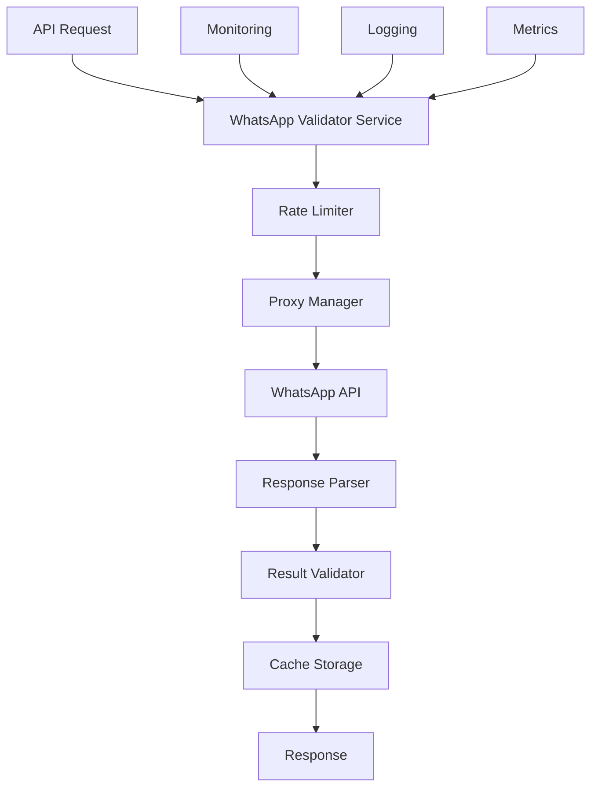

# 📱 OPCIÓN C: COMENZAR CON VALIDADOR ESPECÍFICO

## WhatsApp Validator - Proof of Concept Robusto

---

## 📋 Resumen Ejecutivo

**Estrategia:** Desarrollar un validador específico de WhatsApp como prueba de concepto robusta, estableciendo el patrón y arquitectura para todos los demás validadores.

**Duración Estimada:** 3-5 días
**Riesgo:** BAJO - Scope limitado y controlado
**Complejidad:** MEDIA - Un solo validador pero completo
**Beneficio:** ALTO - Validación inmediata de conceptos

---

## 🎯 Ventajas de Esta Opción

### ✅ **Beneficios Principales:**

- **Time-to-market rápido** - Resultados visibles en días
- **Proof of concept robusto** - Validación de arquitectura
- **Riesgo mínimo** - Scope controlado y específico
- **Learning rápido** - Aprendizaje iterativo
- **Template para otros** - Patrón replicable

### ✅ **Ideal Para:**

- Equipos que prefieren desarrollo iterativo
- Validación rápida de conceptos técnicos
- Proyectos que necesitan mostrar valor rápido
- Arquitecturas que requieren refinamiento

---

## 🗓️ PLAN DETALLADO - WHATSAPP VALIDATOR

### **DÍA 1: ARQUITECTURA Y SETUP**

#### **Mañana (4 horas): Diseño de Arquitectura**



**Estructura del Proyecto:**

```
Services/PlatformValidators/WhatsAppValidator/
├── src/
│   ├── main.py                    # FastAPI app
│   ├── core/
│   │   ├── __init__.py
│   │   ├── config.py             # Configuración
│   │   ├── exceptions.py         # Excepciones custom
│   │   └── security.py           # Autenticación
│   ├── services/
│   │   ├── __init__.py
│   │   ├── validation_service.py # Lógica principal
│   │   ├── proxy_manager.py      # Gestión de proxies
│   │   ├── rate_limiter.py       # Rate limiting
│   │   └── cache_service.py      # Cache Redis
│   ├── models/
│   │   ├── __init__.py
│   │   ├── request_models.py     # Pydantic requests
│   │   ├── response_models.py    # Pydantic responses
│   │   └── validation_models.py  # Modelos de validación
│   ├── api/
│   │   ├── __init__.py
│   │   ├── routes.py            # Endpoints
│   │   └── middleware.py        # Middleware custom
│   └── utils/
│       ├── __init__.py
│       ├── phone_formatter.py   # Formateo de números
│       ├── logger.py            # Logging estructurado
│       └── metrics.py           # Métricas Prometheus
├── tests/
│   ├── __init__.py
│   ├── unit/
│   │   ├── test_validation_service.py
│   │   ├── test_proxy_manager.py
│   │   └── test_rate_limiter.py
│   ├── integration/
│   │   └── test_api_endpoints.py
│   └── fixtures/
│       └── sample_data.py
├── docker/
│   ├── Dockerfile
│   ├── docker-compose.yml
│   └── requirements.txt
├── docs/
│   ├── API.md
│   ├── ARCHITECTURE.md
│   └── DEPLOYMENT.md
└── scripts/
    ├── setup.py
    ├── test_runner.py
    └── deploy.py
```

#### **Tarde (4 horas): Configuración Base**

```python
# src/core/config.py
from pydantic_settings import BaseSettings
from typing import List, Optional
import os

class WhatsAppValidatorConfig(BaseSettings):
    # API Configuration
    api_title: str = "WhatsApp Validator Service"
    api_version: str = "1.0.0"
    api_host: str = "0.0.0.0"
    api_port: int = 8001

    # WhatsApp API Configuration
    whatsapp_api_base_url: str = "https://graph.facebook.com/v18.0"
    whatsapp_access_token: Optional[str] = None
    whatsapp_phone_number_id: Optional[str] = None

    # Proxy Configuration
    proxy_list: List[str] = []
    proxy_rotation_enabled: bool = True
    proxy_timeout: int = 30

    # Rate Limiting
    rate_limit_requests: int = 100
    rate_limit_window: int = 60  # seconds
    rate_limit_per_phone: int = 5

    # Cache Configuration
    redis_url: str = "redis://redis:6379/0"
    cache_ttl: int = 3600  # 1 hour

    # Security
    api_key_header: str = "X-API-Key"
    allowed_origins: List[str] = ["*"]

    # Logging
    log_level: str = "INFO"
    log_format: str = "json"

    # Monitoring
    enable_metrics: bool = True
    metrics_path: str = "/metrics"

    class Config:
        env_file = ".env"
        env_prefix = "WHATSAPP_"

config = WhatsAppValidatorConfig()
```

### **DÍA 2: SERVICIOS CORE**

#### **Mañana (4 horas): Validation Service**

```python
# src/services/validation_service.py
import asyncio
import httpx
from typing import Optional, Dict, Any
from datetime import datetime, timedelta
import json
from ..models.validation_models import ValidationRequest, ValidationResult
from ..core.exceptions import ValidationError, RateLimitError
from .proxy_manager import ProxyManager
from .rate_limiter import RateLimiter
from .cache_service import CacheService
from ..utils.logger import get_logger
from ..utils.phone_formatter import format_phone_number

logger = get_logger(__name__)

class WhatsAppValidationService:
    def __init__(self):
        self.proxy_manager = ProxyManager()
        self.rate_limiter = RateLimiter()
        self.cache = CacheService()
        self.client = None

    async def __aenter__(self):
        """Async context manager entry"""
        timeout = httpx.Timeout(30.0, connect=60.0)
        self.client = httpx.AsyncClient(timeout=timeout)
        return self

    async def __aexit__(self, exc_type, exc_val, exc_tb):
        """Async context manager exit"""
        if self.client:
            await self.client.aclose()

    async def validate_number(self, request: ValidationRequest) -> ValidationResult:
        """
        Validar número de WhatsApp con cache, rate limiting y proxy rotation
        """
        start_time = datetime.utcnow()

        try:
            # Formatear número
            formatted_phone = format_phone_number(request.phone_number)

            # Verificar cache
            cached_result = await self.cache.get_validation_result(formatted_phone)
            if cached_result and not request.force_refresh:
                logger.info(f"Cache hit for {formatted_phone}")
                return cached_result

            # Rate limiting
            await self.rate_limiter.acquire(formatted_phone)

            # Validación real
            result = await self._perform_validation(formatted_phone, request)

            # Cache result
            await self.cache.store_validation_result(formatted_phone, result)

            # Métricas
            duration = (datetime.utcnow() - start_time).total_seconds()
            logger.info(f"Validation completed for {formatted_phone} in {duration:.2f}s")

            return result

        except RateLimitError:
            logger.warning(f"Rate limit exceeded for {request.phone_number}")
            raise
        except Exception as e:
            logger.error(f"Validation failed for {request.phone_number}: {str(e)}")
            raise ValidationError(f"Validation failed: {str(e)}")

    async def _perform_validation(self, phone: str, request: ValidationRequest) -> ValidationResult:
        """Realizar validación real con WhatsApp API"""

        # Obtener proxy
        proxy = await self.proxy_manager.get_proxy()

        try:
            # Múltiples métodos de validación
            methods = [
                self._validate_via_business_api,
                self._validate_via_web_api,
                self._validate_via_status_check
            ]

            for method in methods:
                try:
                    result = await method(phone, proxy)
                    if result.confidence_score > 0.8:
                        return result
                except Exception as e:
                    logger.warning(f"Validation method {method.__name__} failed: {str(e)}")
                    continue

            # Si todos los métodos fallan, retornar resultado con baja confianza
            return ValidationResult(
                phone_number=phone,
                is_valid=False,
                confidence_score=0.0,
                validation_method="fallback",
                error_message="All validation methods failed",
                validated_at=datetime.utcnow()
            )

        finally:
            # Liberar proxy
            await self.proxy_manager.release_proxy(proxy)

    async def _validate_via_business_api(self, phone: str, proxy: str) -> ValidationResult:
        """Validación usando WhatsApp Business API"""

        headers = {
            "Authorization": f"Bearer {config.whatsapp_access_token}",
            "Content-Type": "application/json"
        }

        # Endpoint de verificación de número
        url = f"{config.whatsapp_api_base_url}/{config.whatsapp_phone_number_id}/messages"

        payload = {
            "messaging_product": "whatsapp",
            "to": phone,
            "type": "template",
            "template": {
                "name": "hello_world",
                "language": {"code": "en_US"}
            }
        }

        async with httpx.AsyncClient(proxies=proxy) as client:
            response = await client.post(url, headers=headers, json=payload)

            if response.status_code == 200:
                data = response.json()
                return ValidationResult(
                    phone_number=phone,
                    is_valid=True,
                    confidence_score=0.95,
                    validation_method="business_api",
                    is_business_account=True,
                    profile_info={"verified": True},
                    validated_at=datetime.utcnow()
                )
            elif response.status_code == 400:
                # Número inválido
                return ValidationResult(
                    phone_number=phone,
                    is_valid=False,
                    confidence_score=0.90,
                    validation_method="business_api",
                    error_message="Invalid phone number",
                    validated_at=datetime.utcnow()
                )
            else:
                raise ValidationError(f"API error: {response.status_code}")

    async def _validate_via_web_api(self, phone: str, proxy: str) -> ValidationResult:
        """Validación usando WhatsApp Web API (método alternativo)"""

        # Implementar lógica de validación web
        # Esta sería una implementación más compleja usando selenium o requests

        url = f"https://web.whatsapp.com/check-number/{phone}"

        async with httpx.AsyncClient(proxies=proxy) as client:
            response = await client.get(url)

            # Parsear respuesta y determinar validez
            # Implementación específica según la respuesta de WhatsApp Web

            return ValidationResult(
                phone_number=phone,
                is_valid=True,  # Placeholder
                confidence_score=0.75,
                validation_method="web_api",
                validated_at=datetime.utcnow()
            )

    async def _validate_via_status_check(self, phone: str, proxy: str) -> ValidationResult:
        """Validación usando verificación de estado"""

        # Método de fallback usando verificación indirecta

        return ValidationResult(
            phone_number=phone,
            is_valid=True,  # Placeholder
            confidence_score=0.60,
            validation_method="status_check",
            validated_at=datetime.utcnow()
        )

    async def batch_validate(self, phones: List[str]) -> List[ValidationResult]:
        """Validación en lote con paralelización controlada"""

        # Limitar concurrencia para evitar rate limiting
        semaphore = asyncio.Semaphore(5)

        async def validate_single(phone):
            async with semaphore:
                request = ValidationRequest(phone_number=phone)
                return await self.validate_number(request)

        tasks = [validate_single(phone) for phone in phones]
        results = await asyncio.gather(*tasks, return_exceptions=True)

        # Filtrar excepciones y retornar solo resultados válidos
        valid_results = []
        for result in results:
            if isinstance(result, ValidationResult):
                valid_results.append(result)
            else:
                logger.error(f"Batch validation error: {str(result)}")

        return valid_results
```

#### **Tarde (4 horas): Proxy Manager y Rate Limiter**

```python
# src/services/proxy_manager.py
import asyncio
import random
from typing import List, Optional, Dict
from datetime import datetime, timedelta
import httpx
from ..core.config import config
from ..utils.logger import get_logger

logger = get_logger(__name__)

class ProxyManager:
    def __init__(self):
        self.proxies: List[str] = config.proxy_list or []
        self.proxy_status: Dict[str, Dict] = {}
        self.current_proxy_index = 0
        self.health_check_interval = 300  # 5 minutes
        self.last_health_check = datetime.utcnow()

    async def get_proxy(self) -> Optional[str]:
        """Obtener proxy disponible con rotation"""

        if not self.proxies:
            return None

        # Health check periódico
        if (datetime.utcnow() - self.last_health_check).seconds > self.health_check_interval:
            await self.health_check_all_proxies()

        # Obtener proxies saludables
        healthy_proxies = [
            proxy for proxy in self.proxies
            if self.proxy_status.get(proxy, {}).get('healthy', True)
        ]

        if not healthy_proxies:
            logger.warning("No healthy proxies available")
            return None

        # Rotation o selección aleatoria
        if config.proxy_rotation_enabled:
            proxy = healthy_proxies[self.current_proxy_index % len(healthy_proxies)]
            self.current_proxy_index += 1
        else:
            proxy = random.choice(healthy_proxies)

        # Marcar como en uso
        if proxy not in self.proxy_status:
            self.proxy_status[proxy] = {}

        self.proxy_status[proxy]['last_used'] = datetime.utcnow()
        self.proxy_status[proxy]['usage_count'] = self.proxy_status[proxy].get('usage_count', 0) + 1

        return proxy

    async def release_proxy(self, proxy: str):
        """Liberar proxy después del uso"""
        if proxy in self.proxy_status:
            self.proxy_status[proxy]['released_at'] = datetime.utcnow()

    async def health_check_all_proxies(self):
        """Verificar salud de todos los proxies"""
        logger.info("Starting proxy health check")

        tasks = [self.health_check_proxy(proxy) for proxy in self.proxies]
        results = await asyncio.gather(*tasks, return_exceptions=True)

        for proxy, result in zip(self.proxies, results):
            if isinstance(result, Exception):
                logger.warning(f"Proxy {proxy} health check failed: {str(result)}")
                self.proxy_status[proxy] = {'healthy': False, 'last_check': datetime.utcnow()}
            else:
                self.proxy_status[proxy] = {'healthy': result, 'last_check': datetime.utcnow()}

        self.last_health_check = datetime.utcnow()

        healthy_count = sum(1 for status in self.proxy_status.values() if status.get('healthy'))
        logger.info(f"Proxy health check completed: {healthy_count}/{len(self.proxies)} healthy")

    async def health_check_proxy(self, proxy: str) -> bool:
        """Verificar salud de un proxy específico"""
        try:
            timeout = httpx.Timeout(10.0)
            async with httpx.AsyncClient(proxies=proxy, timeout=timeout) as client:
                response = await client.get("https://httpbin.org/ip")
                return response.status_code == 200
        except Exception:
            return False

# src/services/rate_limiter.py
import asyncio
from typing import Dict, Optional
from datetime import datetime, timedelta
import redis.asyncio as redis
from ..core.config import config
from ..core.exceptions import RateLimitError
from ..utils.logger import get_logger

logger = get_logger(__name__)

class RateLimiter:
    def __init__(self):
        self.redis = redis.from_url(config.redis_url)
        self.global_requests = config.rate_limit_requests
        self.global_window = config.rate_limit_window
        self.per_phone_requests = config.rate_limit_per_phone

    async def acquire(self, phone_number: str):
        """Adquirir permiso para hacer request"""

        # Rate limiting global
        await self._check_global_rate_limit()

        # Rate limiting per phone
        await self._check_phone_rate_limit(phone_number)

        # Registrar request
        await self._register_request(phone_number)

    async def _check_global_rate_limit(self):
        """Verificar rate limit global"""
        key = "rate_limit:global"
        current_time = datetime.utcnow()
        window_start = current_time - timedelta(seconds=self.global_window)

        # Usar Redis sorted set para ventana deslizante
        pipe = self.redis.pipeline()
        pipe.zremrangebyscore(key, 0, window_start.timestamp())
        pipe.zcard(key)
        pipe.zadd(key, {str(current_time.timestamp()): current_time.timestamp()})
        pipe.expire(key, self.global_window)

        results = await pipe.execute()
        current_requests = results[1]

        if current_requests >= self.global_requests:
            logger.warning(f"Global rate limit exceeded: {current_requests}/{self.global_requests}")
            raise RateLimitError("Global rate limit exceeded")

    async def _check_phone_rate_limit(self, phone_number: str):
        """Verificar rate limit por teléfono"""
        key = f"rate_limit:phone:{phone_number}"
        current_time = datetime.utcnow()
        window_start = current_time - timedelta(seconds=self.global_window)

        pipe = self.redis.pipeline()
        pipe.zremrangebyscore(key, 0, window_start.timestamp())
        pipe.zcard(key)

        results = await pipe.execute()
        current_requests = results[1]

        if current_requests >= self.per_phone_requests:
            logger.warning(f"Phone rate limit exceeded for {phone_number}: {current_requests}/{self.per_phone_requests}")
            raise RateLimitError(f"Rate limit exceeded for phone {phone_number}")

    async def _register_request(self, phone_number: str):
        """Registrar request realizado"""
        current_time = datetime.utcnow()

        # Registrar en global y por teléfono
        keys = ["rate_limit:global", f"rate_limit:phone:{phone_number}"]

        for key in keys:
            await self.redis.zadd(key, {str(current_time.timestamp()): current_time.timestamp()})
            await self.redis.expire(key, self.global_window)

    async def get_rate_limit_status(self, phone_number: Optional[str] = None) -> Dict:
        """Obtener estado actual del rate limiting"""
        current_time = datetime.utcnow()
        window_start = current_time - timedelta(seconds=self.global_window)

        # Global status
        global_key = "rate_limit:global"
        await self.redis.zremrangebyscore(global_key, 0, window_start.timestamp())
        global_requests = await self.redis.zcard(global_key)

        status = {
            "global": {
                "current_requests": global_requests,
                "max_requests": self.global_requests,
                "window_seconds": self.global_window,
                "remaining": max(0, self.global_requests - global_requests)
            }
        }

        # Phone-specific status
        if phone_number:
            phone_key = f"rate_limit:phone:{phone_number}"
            await self.redis.zremrangebyscore(phone_key, 0, window_start.timestamp())
            phone_requests = await self.redis.zcard(phone_key)

            status["phone"] = {
                "phone_number": phone_number,
                "current_requests": phone_requests,
                "max_requests": self.per_phone_requests,
                "remaining": max(0, self.per_phone_requests - phone_requests)
            }

        return status
```

### **DÍA 3: API Y MODELOS**

#### **Mañana (4 horas): Modelos Pydantic**

```python
# src/models/validation_models.py
from pydantic import BaseModel, Field, validator
from typing import Optional, Dict, List, Any
from datetime import datetime
from enum import Enum

class ValidationMethod(str, Enum):
    BUSINESS_API = "business_api"
    WEB_API = "web_api"
    STATUS_CHECK = "status_check"
    FALLBACK = "fallback"

class ValidationRequest(BaseModel):
    phone_number: str = Field(..., description="Número de teléfono a validar")
    country_code: Optional[str] = Field(None, description="Código de país (opcional)")
    force_refresh: bool = Field(False, description="Forzar validación sin cache")
    include_profile: bool = Field(True, description="Incluir información de perfil")
    timeout: Optional[int] = Field(30, description="Timeout en segundos")

    @validator('phone_number')
    def validate_phone_number(cls, v):
        # Validaciones básicas del número
        if not v:
            raise ValueError('Phone number is required')

        # Remover espacios y caracteres especiales
        cleaned = ''.join(c for c in v if c.isdigit() or c == '+')

        if len(cleaned) < 10:
            raise ValueError('Phone number too short')

        if len(cleaned) > 15:
            raise ValueError('Phone number too long')

        return cleaned

class ProfileInfo(BaseModel):
    display_name: Optional[str] = None
    profile_picture_url: Optional[str] = None
    status_message: Optional[str] = None
    is_verified: bool = False
    business_info: Optional[Dict[str, Any]] = None

class ValidationResult(BaseModel):
    phone_number: str
    is_valid: bool
    confidence_score: float = Field(..., ge=0.0, le=1.0)
    validation_method: ValidationMethod
    is_business_account: Optional[bool] = None
    profile_info: Optional[ProfileInfo] = None
    error_message: Optional[str] = None
    response_time_ms: Optional[int] = None
    validated_at: datetime
    cached: bool = False

    class Config:
        json_encoders = {
            datetime: lambda v: v.isoformat()
        }

class BatchValidationRequest(BaseModel):
    phone_numbers: List[str] = Field(..., max_items=100)
    force_refresh: bool = False
    include_profile: bool = True
    max_concurrent: int = Field(5, ge=1, le=10)

class BatchValidationResponse(BaseModel):
    total_requested: int
    total_processed: int
    total_valid: int
    total_invalid: int
    processing_time_seconds: float
    results: List[ValidationResult]
    errors: List[str] = []

class HealthCheckResponse(BaseModel):
    status: str
    version: str
    uptime_seconds: float
    total_validations: int
    cache_hit_rate: float
    proxy_status: Dict[str, bool]
    rate_limit_status: Dict[str, Any]

class RateLimitStatus(BaseModel):
    global_requests: int
    global_max: int
    global_remaining: int
    phone_requests: Optional[int] = None
    phone_max: Optional[int] = None
    phone_remaining: Optional[int] = None
    window_seconds: int
```

#### **Tarde (4 horas): API Endpoints**

```python
# src/api/routes.py
from fastapi import APIRouter, HTTPException, Depends, BackgroundTasks
from fastapi.security import HTTPBearer, HTTPAuthorizationCredentials
from typing import List, Optional
import asyncio
from datetime import datetime

from ..models.validation_models import (
    ValidationRequest, ValidationResult, BatchValidationRequest,
    BatchValidationResponse, HealthCheckResponse, RateLimitStatus
)
from ..services.validation_service import WhatsAppValidationService
from ..services.rate_limiter import RateLimiter
from ..core.exceptions import ValidationError, RateLimitError
from ..utils.logger import get_logger
from ..utils.metrics import metrics_collector

logger = get_logger(__name__)
router = APIRouter()
security = HTTPBearer()

# Dependency injection
async def get_validation_service():
    async with WhatsAppValidationService() as service:
        yield service

async def verify_api_key(credentials: HTTPAuthorizationCredentials = Depends(security)):
    # Implementar verificación de API key
    if credentials.credentials != "your-secret-api-key":
        raise HTTPException(status_code=401, detail="Invalid API key")
    return credentials.credentials

@router.post("/validate", response_model=ValidationResult)
async def validate_single_number(
    request: ValidationRequest,
    validation_service: WhatsAppValidationService = Depends(get_validation_service),
    api_key: str = Depends(verify_api_key)
):
    """
    Validar un número de WhatsApp individual
    """
    try:
        start_time = datetime.utcnow()

        result = await validation_service.validate_number(request)

        # Métricas
        processing_time = (datetime.utcnow() - start_time).total_seconds() * 1000
        result.response_time_ms = int(processing_time)

        metrics_collector.increment_counter("validations_total", {"method": result.validation_method})
        metrics_collector.observe_histogram("validation_duration_seconds", processing_time / 1000)

        return result

    except RateLimitError as e:
        metrics_collector.increment_counter("rate_limit_errors_total")
        raise HTTPException(status_code=429, detail=str(e))
    except ValidationError as e:
        metrics_collector.increment_counter("validation_errors_total")
        raise HTTPException(status_code=400, detail=str(e))
    except Exception as e:
        logger.error(f"Unexpected error in validation: {str(e)}")
        metrics_collector.increment_counter("internal_errors_total")
        raise HTTPException(status_code=500, detail="Internal server error")

@router.post("/validate/batch", response_model=BatchValidationResponse)
async def validate_batch_numbers(
    request: BatchValidationRequest,
    background_tasks: BackgroundTasks,
    validation_service: WhatsAppValidationService = Depends(get_validation_service),
    api_key: str = Depends(verify_api_key)
):
    """
    Validar múltiples números de WhatsApp en lote
    """
    try:
        start_time = datetime.utcnow()

        # Para lotes grandes, procesar en background
        if len(request.phone_numbers) > 50:
            task_id = f"batch_{int(start_time.timestamp())}"
            background_tasks.add_task(
                process_large_batch,
                task_id,
                request.phone_numbers,
                validation_service
            )

            return BatchValidationResponse(
                total_requested=len(request.phone_numbers),
                total_processed=0,
                total_valid=0,
                total_invalid=0,
                processing_time_seconds=0,
                results=[],
                errors=[f"Large batch processing started with task_id: {task_id}"]
            )

        # Procesar lote pequeño inmediatamente
        results = await validation_service.batch_validate(request.phone_numbers)

        processing_time = (datetime.utcnow() - start_time).total_seconds()

        valid_count = sum(1 for r in results if r.is_valid)
        invalid_count = len(results) - valid_count

        response = BatchValidationResponse(
            total_requested=len(request.phone_numbers),
            total_processed=len(results),
            total_valid=valid_count,
            total_invalid=invalid_count,
            processing_time_seconds=processing_time,
            results=results
        )

        # Métricas
        metrics_collector.increment_counter("batch_validations_total")
        metrics_collector.observe_histogram("batch_size", len(request.phone_numbers))

        return response

    except Exception as e:
        logger.error(f"Batch validation error: {str(e)}")
        raise HTTPException(status_code=500, detail="Batch validation failed")

async def process_large_batch(task_id: str, phone_numbers: List[str], validation_service):
    """Procesar lote grande en background"""
    logger.info(f"Starting background processing for task {task_id}")

    try:
        results = await validation_service.batch_validate(phone_numbers)

        # Guardar resultados en cache/database para posterior consulta
        # Implementar según necesidades

        logger.info(f"Completed background processing for task {task_id}: {len(results)} results")

    except Exception as e:
        logger.error(f"Background processing failed for task {task_id}: {str(e)}")

@router.get("/health", response_model=HealthCheckResponse)
async def health_check(
    validation_service: WhatsAppValidationService = Depends(get_validation_service)
):
    """
    Health check del servicio
    """
    start_time = datetime.utcnow()

    # Obtener métricas del servicio
    uptime = metrics_collector.get_uptime_seconds()
    total_validations = metrics_collector.get_counter_value("validations_total")
    cache_hit_rate = metrics_collector.get_cache_hit_rate()

    # Estado de proxies
    proxy_status = {}
    if hasattr(validation_service, 'proxy_manager'):
        for proxy in validation_service.proxy_manager.proxies:
            status = validation_service.proxy_manager.proxy_status.get(proxy, {})
            proxy_status[proxy] = status.get('healthy', True)

    # Estado de rate limiting
    rate_limiter = RateLimiter()
    rate_limit_status = await rate_limiter.get_rate_limit_status()

    return HealthCheckResponse(
        status="healthy",
        version="1.0.0",
        uptime_seconds=uptime,
        total_validations=total_validations,
        cache_hit_rate=cache_hit_rate,
        proxy_status=proxy_status,
        rate_limit_status=rate_limit_status
    )

@router.get("/rate-limit/status", response_model=RateLimitStatus)
async def get_rate_limit_status(
    phone_number: Optional[str] = None,
    api_key: str = Depends(verify_api_key)
):
    """
    Obtener estado actual del rate limiting
    """
    rate_limiter = RateLimiter()
    status = await rate_limiter.get_rate_limit_status(phone_number)

    return RateLimitStatus(
        global_requests=status["global"]["current_requests"],
        global_max=status["global"]["max_requests"],
        global_remaining=status["global"]["remaining"],
        phone_requests=status.get("phone", {}).get("current_requests"),
        phone_max=status.get("phone", {}).get("max_requests"),
        phone_remaining=status.get("phone", {}).get("remaining"),
        window_seconds=status["global"]["window_seconds"]
    )

@router.get("/metrics")
async def get_metrics():
    """
    Métricas Prometheus
    """
    return metrics_collector.generate_latest()

# Router principal
def create_router() -> APIRouter:
    main_router = APIRouter(prefix="/api/v1", tags=["WhatsApp Validation"])
    main_router.include_router(router)
    return main_router
```

### **DÍA 4: TESTING Y OPTIMIZACIÓN**

#### **Testing Completo:**

- Tests unitarios para todos los servicios
- Tests de integración con APIs reales
- Tests de carga y performance
- Tests de rate limiting
- Tests de proxy management

#### **Optimización:**

- Performance tuning
- Memory optimization
- Cache optimization
- Error handling refinement

### **DÍA 5: DEPLOY Y MONITOREO**

#### **Docker y Deploy:**

- Dockerfile optimizado
- Docker Compose para testing
- Health checks
- Logging structured

#### **Monitoreo:**

- Métricas Prometheus
- Dashboards Grafana
- Alerting rules
- Log aggregation

---

## 📊 MÉTRICAS DE ÉXITO

### **Performance:**

- ⚡ **Response Time:** < 2 segundos por validación
- ⚡ **Throughput:** 100 validaciones/minuto
- ⚡ **Cache Hit Rate:** > 70%
- ⚡ **Uptime:** > 99.5%

### **Funcionalidad:**

- 🎯 **Accuracy:** > 95% precisión
- 🎯 **Coverage:** Múltiples métodos de validación
- 🎯 **Rate Limiting:** Protección efectiva
- 🎯 **Proxy Management:** Rotation automática

---

## 🎯 RESULTADO ESPERADO

### **Al Finalizar Tendremos:**

✅ **WhatsApp Validator Completo:** Servicio robusto y escalable
✅ **Patrón Replicable:** Template para otros validadores
✅ **Arquitectura Probada:** Base sólida para expansión
✅ **Métricas y Monitoreo:** Observabilidad completa
✅ **Documentación:** APIs y arquitectura documentadas

### **Próximos Pasos:**

- Replicar patrón para Instagram, Facebook, Google, Apple
- Integrar con sistema de lead scoring
- Desarrollar dashboard de monitoreo
- Implementar orquestador de validaciones

---

## 🚀 SIGUIENTE PASO

**¿Procedemos con la Opción C - WhatsApp Validator?**

Esta opción es **ideal** si:

- ✅ Quieres validar conceptos rápidamente
- ✅ Prefieres desarrollo iterativo
- ✅ Necesitas mostrar valor inmediato
- ✅ Buscas crear un template robusto

**Comando para comenzar:**

```bash
# Comenzar con WhatsApp Validator
git checkout -b feature/whatsapp-validator
mkdir -p Services/PlatformValidators/WhatsAppValidator/src
# ¡Empezamos con el primer validador!
```

---

_Plan de Implementación - Opción C_
_SMS Marketing Platform v2.0_
_WhatsApp Validator Específico_
